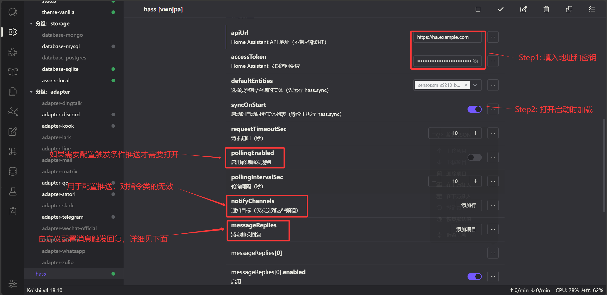
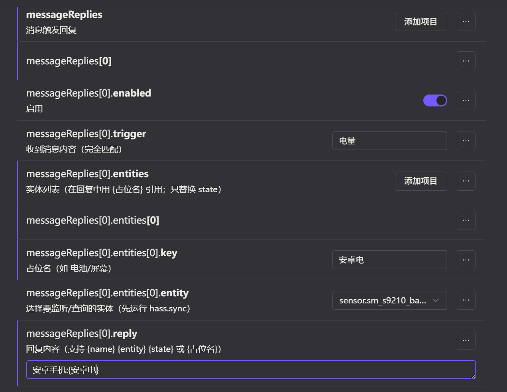
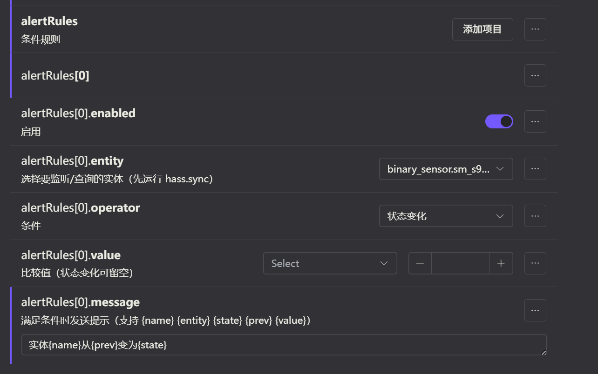

# koishi-plugin-hass

监控homeassistant实体状态变化并支持自定义触发命令进行查询或推送

## 目录
- [安装](#安装)
- [配置](#配置)
- [占位符](#占位符)
- [命令](#命令)
- [平台与通知](#平台与通知)
- [依赖与注意事项](#依赖与注意事项)
- [配置项说明](#配置项说明)

## 安装

在 Koishi 控制台的插件市场中安装。

## 配置
基础配置
- 

消息回复（messageReplies）支持：
- `{占位名}`：只替换为该实体的 `state`（状态值）  
`下面是开启自定义消息回复的示例`

`配置如下:`

规则通知（alertRules）支持：
- `{name}` 实体名称（friendly_name）
- `{entity}` 实体 ID
- `{state}` 当前状态
- `{prev}` 上一次状态（仅状态变化）
- `{value}` 比较值  
示例:

目前只支持纯数字类型的实体状态的大小比较

## 命令

- `hass.sync`：同步实体列表（写入缓存并刷新下拉）
- `hass.schema`：查看实体 schema 同步状态（调试）
- `hass [entity]`：查询实体状态，未指定时使用 `defaultEntities` 的第一个
- `以及可配置自定义的触发消息`

## 平台与通知

`notifyChannels` 需要指定平台是因为频道 ID 在不同平台可能重复，且需要知道用哪个 bot 发送。  
插件会在运行时读取 `ctx.bots`，匹配平台后发送通知。

如果只使用一个平台，也可以只填写该平台的频道 ID 列表。

## 依赖与注意事项

- 必需：`http` 插件（用于请求 Home Assistant API）

## 配置项说明

- apiUrl: Home Assistant API 地址（不带尾部斜杠）
- accessToken: Home Assistant 长期访问令牌
- defaultEntities: hass 命令未指定实体时使用的默认列表
- syncOnStart: 启动时自动同步实体列表（等价于执行 `hass.sync`）
- requestTimeoutSec: 请求超时（秒）
- pollingEnabled: 是否启用轮询触发规则
- pollingIntervalSec: 轮询间隔（秒）
- notifyChannels: 通知目标列表
  - platform: 适配器平台名（如 telegram/discord/qq/sandbox）
  - channelId: 频道 ID（平台内唯一）
  - guildId: 群组/服务器 ID（部分平台需要）
- alertRules: 条件规则列表
  - enabled: 是否启用
  - entity: 监控的实体
  - operator: 条件（gt/gte/lt/lte/eq/neq/changed）
  - value: 比较值（状态变化可留空）
  - message: 触发通知内容
- messageReplies: 消息触发回复列表
  - enabled: 是否启用
  - trigger: 触发消息（完全匹配）
  - entities: 实体列表（在回复中用 {占位名} 引用）
  - reply: 回复内容模板

